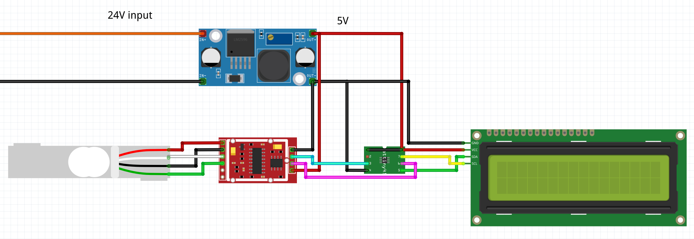

# Filament-holder-weight-display
This project is a filament holder with integrated weight sensor which displays the weight of the filament on an lcd screen.

**table of content**
- [Filament-holder-weight-display](#filament-holder-weight-display)
  - [How it works](#how-it-works)
  - [future implementations](#future-implementations)
  - [programming the system](#programming-the-system)

---
## How it works
This Project gets its power from a buck regulator which regulates the 24V from the 3d Printers power to the 5V needed by the system. The Attiny13 microcontroller reads the weight from the hx711 module which is connected to the 10Kg load cell and calculates the raw weight of the filament by subtracting the weight of the filament holder weight as well as the weight of the filament spool. After calculating the weight of the filament the result gets printed to the 16x2 LCD module.

## future implementations
The Attiny13 reads the value of an Analog Pin to know when a print has finished (when the power gets turned off). If thats the case the microcontroller stores the last read weight on its internal 64 Bytes EEPROM. This system should print the weight difference between the last print (power off) and the current weight to the display as well.

## programming the system

1. program an Arduino as a ISP using the ArduinoAsISP sketch provided in the code section.
2. connect the Attiny13 to the Arduino as shown in this picture.
   
3. upload the main code provided in the code section to the Attiny13.